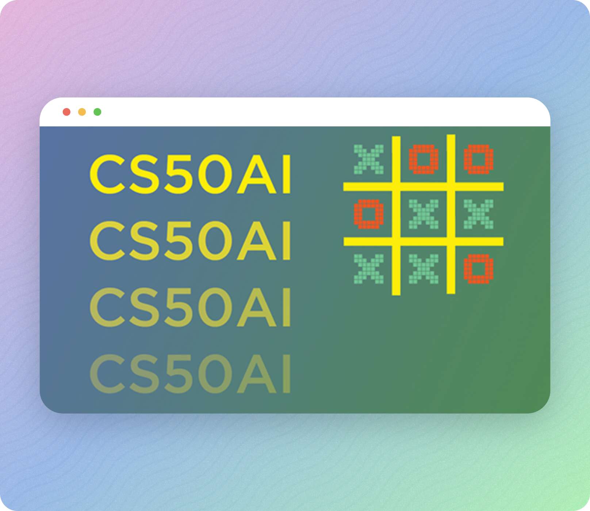
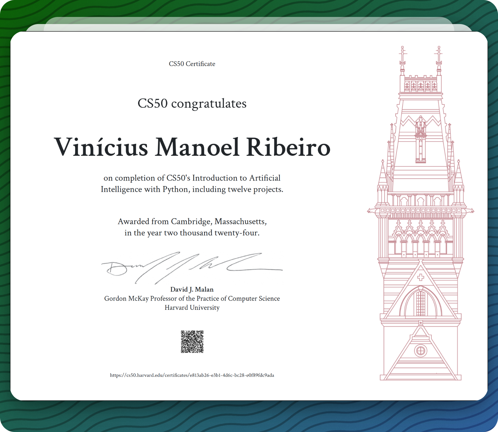
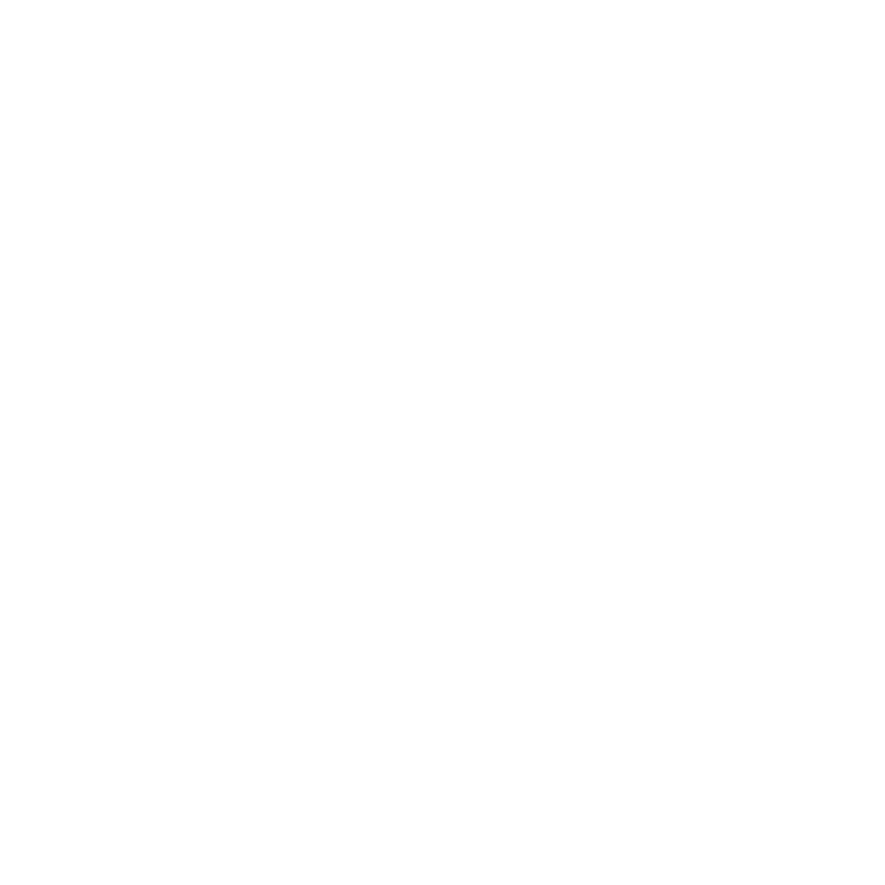

# Harvard CS50AI 2024 Solutions 

This course explores the concepts and algorithms at the foundation of modern artificial intelligence, diving into the ideas that give rise to technologies like game-playing engines, handwriting recognition, and machine translation. Through hands-on projects, students gain exposure to the theory behind graph search algorithms, classification, optimization, machine learning, large language models, and other topics in artificial intelligence as they incorporate them into their own Python programs. By course’s end, students emerge with experience in libraries for machine learning as well as knowledge of artificial intelligence principles that enable them to design intelligent systems of their own.

## Screenshots 🖼️

## Week 0 - Search 🔎

Search Problems. Depth-First Search. Breadth-First Search. Greedy Best-First Search. A* Search. Minimax. Alpha-Beta Pruning.

- [Degrees](./week_0/degrees/degrees.py)
- [Tic-Tac-Toe](./week_0/tictactoe/tictactoe.py)

## Week 1 - Knowledge 💭

Propositional Logic. Entailment. Inference. Model Checking. Resolution. First Order Logic.

- [Knights](./week_1/knights/puzzle.py)
- [Minesweeper](./week_1/minesweeper/minesweeper.py)

## Week 2 - Uncertainty 🧠

Probability. Conditional Probability. Random Variables. Independence. Bayes’ Rule. Joint Probability. Bayesian Networks. Sampling. Markov Models. Hidden Markov Models.

- [PageRank](./week_2/pagerank/pagerank.py)
- [Heredity](./week_2/heredity/heredity.py)

## Week 3 - Optimization ⌛

Local Search. Hill Climbing. Simulated Annealing. Linear Programming. Constraint Satisfaction. Backtracking Search.

- [Crossword](./week_3/crossword/crossword.py)

## Week 4 - Learning 📘

Supervised Learning. Nearest-Neighbor Classification. Perceptron Learning. Support Vector Machines. Regression. Loss Functions. Overfitting. Regularization. Reinforcement Learning. Markov Decision Processes. Q-Learning. Unsupervised Learning. k-means Clustering.

- [Shopping](./week_4/shopping/shopping.py)
- [Nim](./week_4/nim/nim.py)

## Week 5 - Neural Networks 🛜

Artificial Neural Networks. Activation Functions. Gradient Descent. Backpropagation. Overfitting. TensorFlow. Image Convolution. Convolutional Neural Networks. Recurrent Neural Networks.

- [Traffic](./week_5/traffic/traffic.py)

## Week 6 - Language 👅

Syntax. Semantics. Context-Free Grammar. nltk. n-grams. Bag-of-Words Model. Naive Bayes. Word Representation. word2vec. Attention. Transformers.

- [Parser](./week_6/parser/parser.py)
- [Attention](./week_6/attention/mask.py)

## CS50 Certificate 📑

## License 📝

A short and simple permissive license with conditions only requiring preservation of copyright and license notices. Licensed works, modifications, and larger works may be distributed under different terms and without source code.

